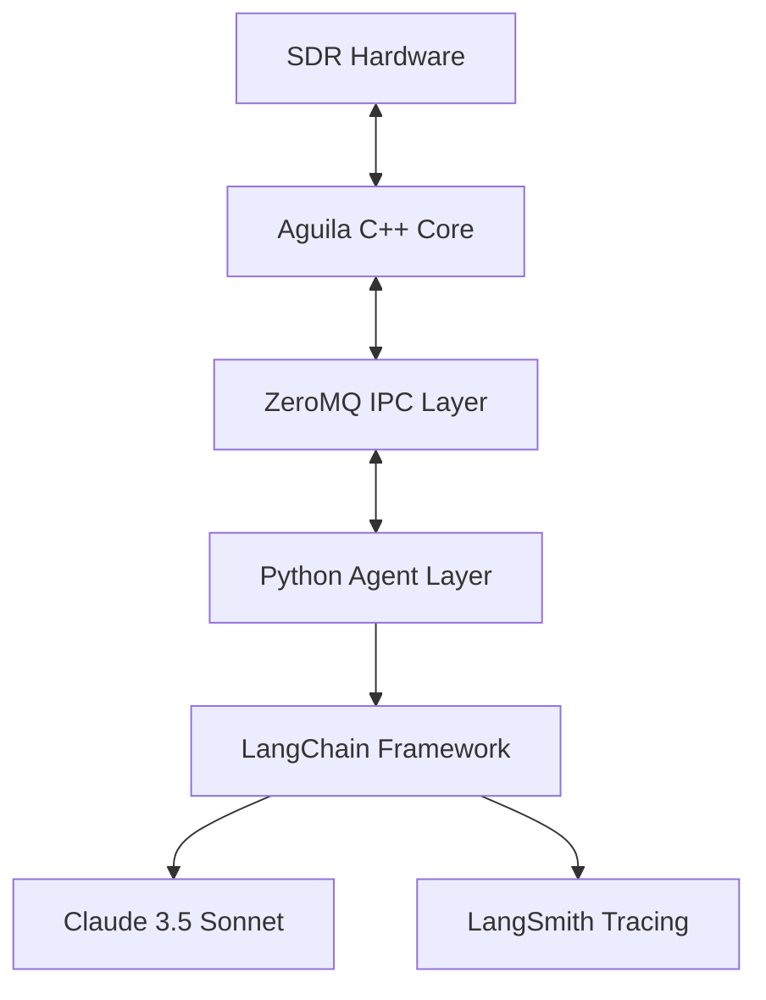

# LangChain & LangSmith Integration Plan for Aguila SDR

## Overview

This document outlines the integration plan for incorporating LangChain and LangSmith into the Aguila SDR project, creating a multi-agent system powered by Claude 3.5 Sonnet.

## Architecture

### High-Level Design


### Components

1. **Aguila C++ Core**
   - Maintains all existing SDR functionality
   - Exposes new IPC endpoints for agent control
   - Implements message queue handlers for async operations

2. **IPC Layer (ZeroMQ)**
   - Bidirectional communication between C++ and Python
   - Message serialization using Protocol Buffers
   - Async message handling with event loops

3. **Python Agent Layer**
   - LangChain agent definitions
   - Tool implementations
   - State management
   - IPC client implementation

## Implementation Plan

### Phase 1: IPC Infrastructure

1. **C++ Side Implementation**
```cpp
// In new file: src/ipc/agent_server.h
class AgentServer {
public:
    AgentServer();
    void start();
    void stop();
    
private:
    zmq::context_t context;
    zmq::socket_t socket;
    std::thread worker_thread;
    
    void handle_messages();
    void process_command(const std::string& cmd);
};

// In new file: src/ipc/agent_server.cpp
void AgentServer::handle_messages() {
    while (running) {
        zmq::message_t request;
        socket.recv(request);
        
        std::string command(static_cast<char*>(request.data()), request.size());
        auto response = process_command(command);
        
        zmq::message_t reply(response.size());
        memcpy(reply.data(), response.data(), response.size());
        socket.send(reply);
    }
}
```

2. **Python Side Implementation**
```python
# In new file: agent/ipc_client.py
class AguilaIPCClient:
    def __init__(self):
        self.context = zmq.Context()
        self.socket = self.context.socket(zmq.REQ)
        self.socket.connect("tcp://localhost:5555")
    
    def send_command(self, command: str) -> str:
        self.socket.send_string(command)
        return self.socket.recv_string()
```

### Phase 2: LangChain Integration

1. **Agent Definitions**
```python
# In new file: agent/sdr_agents.py
from langchain.agents import create_react_agent
from langchain_anthropic import ChatAnthropic
from typing import List, Dict

class SDRAgent:
    def __init__(self, api_key: str, tools: List[Tool], project_name: str = "aguila-project"):
        # Ensure environment is set up before any LangChain imports
        setup_environment(api_key, project_name)
        
        # Now import LangChain components
        from langchain.agents import create_react_agent
        from langchain_anthropic import ChatAnthropic
        
        self.project_name = project_name
        self.llm = ChatAnthropic(
            model="claude-3-sonnet-20240229",
            anthropic_api_key=api_key,
            temperature=0.1
        )
        self.tools = tools
        self.agent = create_react_agent(
            llm=self.llm,
            tools=self.tools,
            prompt=self.get_prompt()
        )
        self.executor = AgentExecutor(
            agent=self.agent,
            tools=self.tools,
            verbose=True
        )
        
        # Verify LangSmith configuration
        self.langsmith_client = get_langsmith_client(project_name)
        print(f"✅ LangSmith configured for project: {self.langsmith_client.project_name}")
    
    def get_prompt(self) -> str:
        return """You are an expert SDR operator.
        Available tools:
        {tools}
        
        Always explain your reasoning before taking actions.
        Current frequency: {frequency}
        Current mode: {mode}
        Signal strength: {signal_strength}
        
        Human: {input}
        Assistant: Let me help you with that."""
```

2. **Tool Definitions**
```python
# In new file: agent/sdr_tools.py
from langchain.tools import tool
from .ipc_client import AguilaIPCClient

client = AguilaIPCClient()

@tool
def tune_frequency(freq_mhz: float) -> str:
    """Tune the SDR receiver to a specific frequency in MHz."""
    response = client.send_command(f"TUNE:{freq_mhz}")
    return f"Tuned to {freq_mhz} MHz. Response: {response}"

@tool
def set_demod_mode(mode: str) -> str:
    """Set the demodulation mode (AM/FM/SSB/CW)."""
    response = client.send_command(f"MODE:{mode}")
    return f"Set mode to {mode}. Response: {response}"

@tool
def capture_spectrum(span_khz: int) -> str:
    """Capture spectrum data with specified span in kHz."""
    response = client.send_command(f"CAPTURE:{span_khz}")
    return f"Captured {span_khz}kHz spectrum. Response: {response}"
```

### Phase 3: LangSmith Integration

1. **Environment Setup and Project Configuration**
```python
# In new file: agent/config.py
import os
from typing import Optional
from langsmith import Client

def setup_environment(langsmith_api_key: str, project_name: str = "aguila-project"):
    """Set up environment variables before any LangChain imports."""
    os.environ["LANGCHAIN_TRACING_V2"] = "true"
    os.environ["LANGCHAIN_API_KEY"] = langsmith_api_key
    os.environ["LANGCHAIN_PROJECT"] = project_name
    
    # Verify environment setup
    if os.environ.get("LANGCHAIN_PROJECT") != project_name:
        raise EnvironmentError(
            f"Failed to set LANGCHAIN_PROJECT. Expected {project_name}, "
            f"got {os.environ.get('LANGCHAIN_PROJECT')}"
        )

def get_langsmith_client(project_name: str = "aguila-project") -> Client:
    """Get LangSmith client with explicit project configuration."""
    client = Client()
    client.project_name = project_name  # Explicit project setting
    return client

def create_agent_config(
    agent_type: str,
    operation: str,
    frequency: Optional[float] = None,
    mode: Optional[str] = None
) -> dict:
    """Create agent configuration with project name and metadata."""
    return {
        "configurable": {
            "project_name": os.environ["LANGCHAIN_PROJECT"]
        },
        "metadata": {
            "agent": agent_type,
            "operation": operation,
            "frequency": frequency,
            "mode": mode,
            "timestamp": datetime.now().isoformat()
        }
    }
```

2. **Agent Integration with Project Configuration**
```python
# Update in agent/sdr_agents.py
class SDRAgent:
    def __init__(self, api_key: str, tools: List[Tool], project_name: str = "aguila-project"):
        # Ensure environment is set up before any LangChain imports
        setup_environment(api_key, project_name)
        
        # Now import LangChain components
        from langchain.agents import create_react_agent
        from langchain_anthropic import ChatAnthropic
        
        self.project_name = project_name
        self.llm = ChatAnthropic(
            model="claude-3-sonnet-20240229",
            anthropic_api_key=api_key,
            temperature=0.1
        )
        self.tools = tools
        self.agent = create_react_agent(
            llm=self.llm,
            tools=self.tools,
            prompt=self.get_prompt()
        )
        self.executor = AgentExecutor(
            agent=self.agent,
            tools=self.tools,
            verbose=True
        )
        
        # Verify LangSmith configuration
        self.langsmith_client = get_langsmith_client(project_name)
        print(f"✅ LangSmith configured for project: {self.langsmith_client.project_name}")
    
    def execute(self, input_text: str, **kwargs) -> Dict:
        """Execute agent with proper project configuration."""
        config = create_agent_config(
            agent_type=kwargs.get("agent_type", "sdr_operator"),
            operation=kwargs.get("operation", "general"),
            frequency=kwargs.get("frequency"),
            mode=kwargs.get("mode")
        )
        
        return self.executor.invoke(
            {"input": input_text},
            config=config
        )
```

3. **Testing Project Configuration**
```python
# In new file: tests/test_langsmith_config.py
def test_project_configuration():
    # Test environment setup
    setup_environment("test_key", "test_project")
    assert os.environ["LANGCHAIN_PROJECT"] == "test_project"
    
    # Test client configuration
    client = get_langsmith_client("test_project")
    assert client.project_name == "test_project"
    
    # Test agent config generation
    config = create_agent_config("test_agent", "test_op")
    assert config["configurable"]["project_name"] == "test_project"
    assert "agent" in config["metadata"]

def test_agent_project_integration():
    agent = SDRAgent(api_key="test_key", tools=[], project_name="test_project")
    assert agent.langsmith_client.project_name == "test_project"
    
    result = agent.execute("Test command")
    # Verify trace appears in correct project via API
    traces = agent.langsmith_client.list_runs(project_name="test_project")
    assert len(traces) > 0
```

## Project Configuration Notes

- **Environment Priority**: Always set environment variables BEFORE importing LangChain/LangSmith
- **Verification**: Added checks to confirm project name is set correctly
- **Multiple Layers**: Project name is set in:
  1. Environment variables
  2. LangSmith client configuration
  3. Agent execution config
- **Debugging**: If traces appear in "default" project:
  1. Print `os.environ["LANGCHAIN_PROJECT"]` to verify setting
  2. Check `client.project_name` in LangSmith client
  3. Verify config dictionary in agent execution
  4. Use `langsmith.Client().list_runs()` to check trace destination

## Testing Strategy

1. **Unit Tests**
```