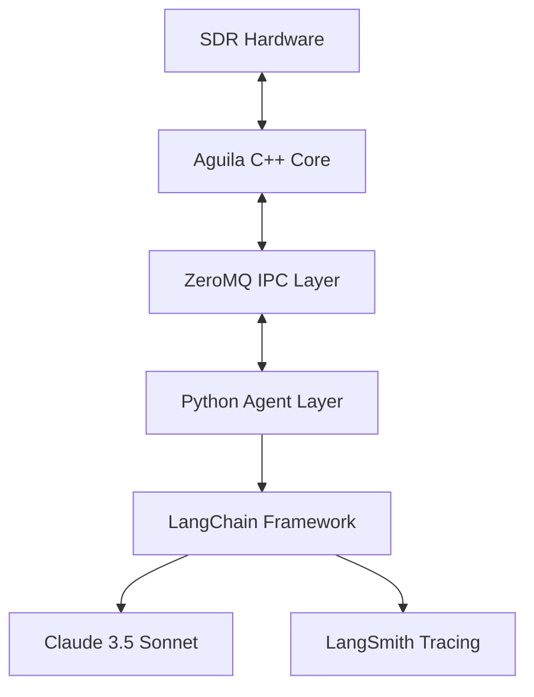
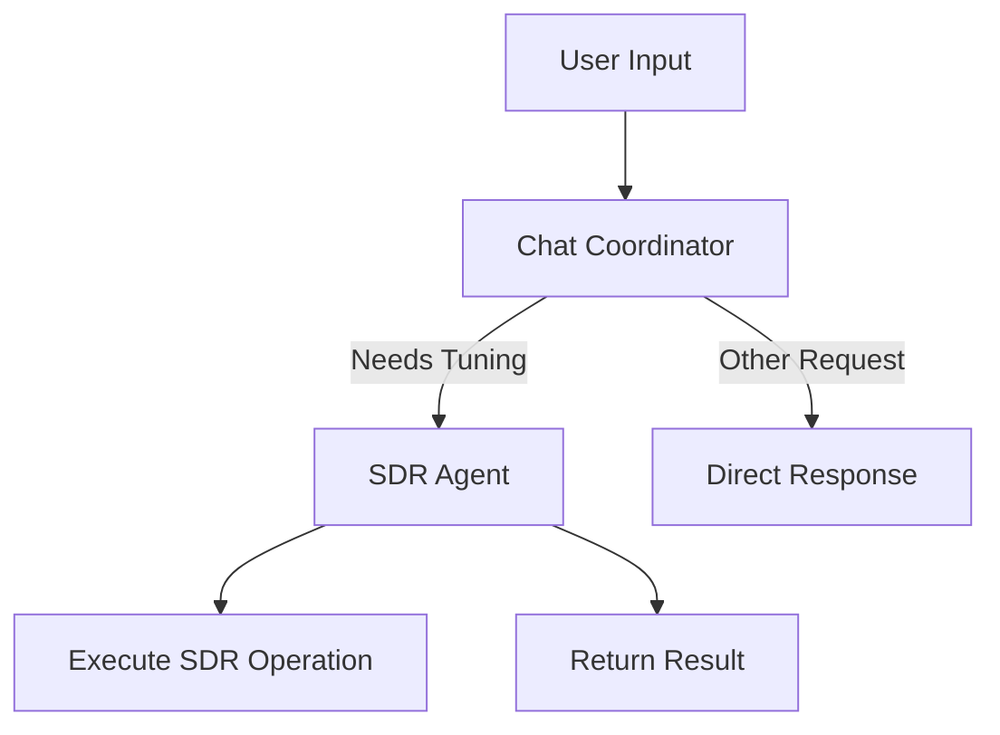

# LangChain & LangSmith Integration Plan for Aguila SDR

## Overview

This document outlines the integration plan for incorporating LangChain and LangSmith into the Aguila SDR project, creating a multi-agent system powered by Claude 3.5 Sonnet.

## Architecture

### High-Level Design


### Components

1. **Aguila C++ Core**
   - Maintains all existing SDR functionality
   - Exposes new IPC endpoints for agent control
   - Implements message queue handlers for async operations

2. **IPC Layer (ZeroMQ)**
   - Bidirectional communication between C++ and Python
   - Message serialization using Protocol Buffers
   - Async message handling with event loops

3. **Python Agent Layer**
   - LangChain agent definitions
   - Tool implementations
   - State management
   - IPC client implementation

## Implementation Plan

### Phase 1: IPC Infrastructure

1. **C++ Side Implementation**
```cpp
// In new file: src/ipc/agent_server.h
class AgentServer {
public:
    AgentServer();
    void start();
    void stop();
    
private:
    zmq::context_t context;
    zmq::socket_t socket;
    std::thread worker_thread;
    
    void handle_messages();
    void process_command(const std::string& cmd);
};

// In new file: src/ipc/agent_server.cpp
void AgentServer::handle_messages() {
    while (running) {
        zmq::message_t request;
        socket.recv(request);
        
        std::string command(static_cast<char*>(request.data()), request.size());
        auto response = process_command(command);
        
        zmq::message_t reply(response.size());
        memcpy(reply.data(), response.data(), response.size());
        socket.send(reply);
    }
}
```

2. **Python Side Implementation**
```python
# In new file: agent/ipc_client.py
class AguilaIPCClient:
    def __init__(self):
        self.context = zmq.Context()
        self.socket = self.context.socket(zmq.REQ)
        self.socket.connect("tcp://localhost:5555")
    
    def send_command(self, command: str) -> str:
        self.socket.send_string(command)
        return self.socket.recv_string()
```

### Phase 2: LangChain Integration

1. **Agent Definitions**
```python
# In new file: agent/sdr_agents.py
from langchain.agents import create_react_agent
from langchain_anthropic import ChatAnthropic
from typing import List, Dict

class BaseAgent:
    """Base agent class with common LangSmith configuration"""
    def __init__(self, api_key: str, tools: List[Tool], project_name: str = "aguila-project"):
        # Ensure environment is set up before any LangChain imports
        setup_environment(api_key, project_name)
        
        self.project_name = project_name
        self.llm = ChatAnthropic(
            model="claude-3-sonnet-20240229",
            anthropic_api_key=api_key,
            temperature=0.1
        )
        self.tools = tools
        
        # Verify LangSmith configuration
        self.langsmith_client = get_langsmith_client(project_name)
        print(f"✅ LangSmith configured for project: {self.langsmith_client.project_name}")

class SDRAgent(BaseAgent):
    """Specific agent for SDR operations"""
    def __init__(self, *args, **kwargs):
        super().__init__(*args, **kwargs)
        self.agent = create_react_agent(
            llm=self.llm,
            tools=self.tools,
            prompt=self.get_prompt()
        )
        self.executor = AgentExecutor(
            agent=self.agent,
            tools=self.tools,
            verbose=True
        )
    
    def get_prompt(self) -> str:
        return """You are an expert SDR operator.
        Available tools:
        {tools}
        
        Always explain your reasoning before taking actions.
        Current frequency: {frequency}
        Current mode: {mode}
        Signal strength: {signal_strength}
        
        Human: {input}
        Assistant: Let me help you with that."""

class ChatCoordinator(BaseAgent):
    """Coordinator agent that determines when to use SDR functionality"""
    def __init__(self, *args, **kwargs):
        super().__init__(*args, **kwargs)
        self.agent = create_react_agent(
            llm=self.llm,
            tools=self.tools,
            prompt=self.get_prompt()
        )
        self.executor = AgentExecutor(
            agent=self.agent,
            tools=self.tools,
            verbose=True
        )
    
    def get_prompt(self) -> str:
        return """You are an expert at understanding user requests related to SDR operations.
        Your primary role is to determine if a user's request requires tuning the radio or other SDR operations.
        
        For any user input, you should:
        1. Analyze if it requires radio tuning or frequency changes
        2. Identify if it's a direct command ("tune to 145 MHz") or indirect request ("show me air traffic")
        3. Provide your reasoning and confidence level
        
        Output your response in the following format:
        REQUIRES_TUNING: [true/false]
        CONFIDENCE: [high/medium/low]
        REASONING: [your detailed reasoning]
        FREQUENCY_MENTIONED: [specific frequency if mentioned, "none" if not]
        
        Human: {input}
        Assistant: Let me analyze that request."""

    def evaluate_request(self, user_input: str) -> Dict:
        """Evaluate if a user request requires SDR operations"""
        config = create_agent_config(
            agent_type="chat_coordinator",
            operation="request_evaluation",
            metadata={
                "input_type": "user_request",
                "evaluation_type": "tuning_need"
            }
        )
        
        return self.executor.invoke(
            {"input": user_input},
            config=config
        )
```

2. **Updated Tool Definitions**
```python
# In new file: agent/coordinator_tools.py
from langchain.tools import tool
from typing import Dict

@tool
def analyze_tuning_request(request: str) -> Dict:
    """Analyze if a request requires radio tuning and extract relevant details."""
    # This is a structured analysis tool that helps the coordinator
    # make decisions about user requests
    return {
        "requires_tuning": True/False,
        "confidence": "high/medium/low",
        "frequency_mentioned": "145MHz" or None,
        "request_type": "direct/indirect/unrelated"
    }
```

### Phase 4: Multi-Agent Coordination

1. **Agent Communication Flow**


2. **Coordination Implementation**
```python
class AguilaSystem:
    def __init__(self, api_key: str, project_name: str = "aguila-project"):
        self.coordinator = ChatCoordinator(
            api_key=api_key,
            tools=[analyze_tuning_request],
            project_name=project_name
        )
        self.sdr_agent = SDRAgent(
            api_key=api_key,
            tools=[tune_frequency, set_demod_mode, capture_spectrum],
            project_name=project_name
        )
    
    def handle_request(self, user_input: str) -> str:
        # First, let the coordinator evaluate the request
        evaluation = self.coordinator.evaluate_request(user_input)
        
        if evaluation["requires_tuning"]:
            # If tuning is needed, pass to SDR agent
            return self.sdr_agent.execute(
                user_input,
                metadata={"coordinator_confidence": evaluation["confidence"]}
            )
        else:
            # Handle non-tuning requests
            return f"This request doesn't require radio tuning. Reason: {evaluation['reasoning']}"
```

## Project Configuration Notes

- **Environment Priority**: Always set environment variables BEFORE importing LangChain/LangSmith
- **Verification**: Added checks to confirm project name is set correctly
- **Multiple Layers**: Project name is set in:
  1. Environment variables
  2. LangSmith client configuration
  3. Agent execution config
- **Debugging**: If traces appear in "default" project:
  1. Print `os.environ["LANGCHAIN_PROJECT"]` to verify setting
  2. Check `client.project_name` in LangSmith client
  3. Verify config dictionary in agent execution
  4. Use `langsmith.Client().list_runs()` to check trace destination

## Testing Strategy

1. **Unit Tests**
```